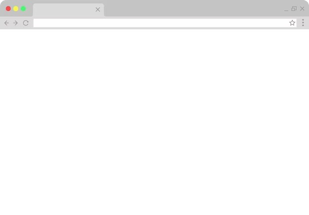

<link rel="stylesheet" href="https://cdnjs.cloudflare.com/ajax/libs/font-awesome/6.5.2/css/all.min.css" integrity="sha512-SnH5WK+bZxgPHs44uWIX+LLJAJ9/2PkPKZ5QiAj6Ta86w+fsb2TkcmfRyVX3pBnMFcV7oQPJkl9QevSCWr3W6A==" crossorigin="anonymous" referrerpolicy="no-referrer" />

# PROJETO MODELO GITHUB
Este projeto tem por finalidade mostrar como subir o meu projeto para o Github e tambem de como elaborar o README.md do projeto

## Índice

- [Visão Geral](#visão-geral)
- [Tecnologias](#tecnologias)
- [Telas](#telas)
- [Instalação](#instalação)
- [Contribuição](#contribuição)
- [Licença](#licença)
- [Contato](#contato)

## Visão Geral

Este projeto visa mostrar para quem está iniciando a importancia da documentação. Tambem visa trabalhar organização e preparar o aluno para o mercado de trabalho.

## Tecnologias

- Neste projeto teremos
### HTML
### CSS
### JAVASCRIPT

## Telas

## Instalação

Apenas faça o clone deste repositorio e em seguida usando o Liveserver abra, super simples - não??

## Contribuição

Você pode ajudar melhorando esse README.

## Licença

## Contato

<i class="fab fa-whatsapp"></i> (51) 9.9999-8888
 
<i class="fab fa-instagram">@jefersonfleon</i>

